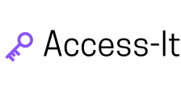

# Access-It

<p align="center">
  
</p>

Access-It is a collection of accessible components that follow WAI-ARIA accessibility guidelines. [Documentation here.](https://sandylcruz.github.io/access-it/)

## Install

```
npm install access-it react styled-components --save
```

```
yarn add access-it react styled-components
```

## Button Arguments

| Argument     | Required? | Description                                                                         |
| ------------ | --------- | ----------------------------------------------------------------------------------- |
| `kind `      | Yes       | Choose the type of button you want. Options are "basic," "primary," or "secondary." |
| `buttonSize` | Yes       | Choose the size of your button. Options are "small," "medium," or "large."          |
| `disabled`   | No        | Choose if button is disabled or not                                                 |
| `style`      | No        | Add your chosen styling                                                             |

## Checkbox Arguments

| Argument   | Required? | Description                                    |
| ---------- | --------- | ---------------------------------------------- |
| `checked ` | No        | Choose if button is pre-checked and controlled |
| `style`    | No        | Add your chosen styling                        |

## Development

In order to start working:

1. Run `yarn start` to get the source code and Webpack server running.
2. Run `yarn start` in `docs` to get the documentation server running.
3. Open `http://localhost:3000`.

To publish:

1. After the repo is in the correct state, bump the package version following [semantic versioning](https://semver.org/).
2. Commit the package bump in a commit with a comment like "Bump to 1.0.1".
3. Run `npm publish --access public`.
